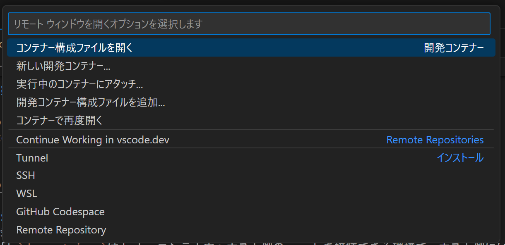

# docker-devcontainer-react-vite
Reactを使用できる高速なビルド環境をdockerのdevcontainerで実現

# 環境前提
* windows PC 10 or 11
* Docker desktop for windows
* docker-compose
* VSCode
* Dev Containers (VSCode拡張機能)

# 構築方法
1. ルートフォルダで以下のコマンドを実行  
```ps
docker-compose up -d --build
```
2. 正常に終了後に以下のリンクにアクセスすると画面が表示される  
http://localhost:5173/

# 開発方法
* 開発は`devcontainer`内で行います。  
  補足:`devcontainer`はdockerコンテナ内へホスト側のvscodeを接続できる環境で、ホスト側にいながらあたかもコンテナ内にいるかのように開発できます。例としてホスト側にはfrontend配下の`node_modules`の中身が存在しない(`npm install`はあくまでコンテナ内で実行されます)ですが、コンテナ内には存在するため`devcontainer`を使用すると`node_modules`が表示されるようになります。またvscodeの拡張機能はこのプロジェクト用にコンテナ内にインストールを行うためホスト側のvscodeの環境を汚染しません。

## `devcontainer`起動方法
1. ルートフォルダ配下をvscodeで立ち上げる  
2. vscodeの左下の`><`をクリック  

3. 「コンテナーで再度開く」(Reopen in container)をクリック  

4. あとは待つだけ　※最初は少しだけ長い  

## 補足
* ホットリロードが有効なのでファイルの変更を保存すればすぐに(http://localhost:5173/)で確認できます。
* `devcontainer`での開発を基本としてください。
* npmでライブラリを追加した後はDockerコンテナとイメージを一度破棄してから、構築をし直して問題なく起動するかも確認してください。  

# 参考
* [React](https://ja.react.dev/)
* [Vite](https://ja.vitejs.dev/)
* [Docker](https://www.docker.com/ja-jp/)
* [Dev Containers](https://code.visualstudio.com/docs/devcontainers/containers)
